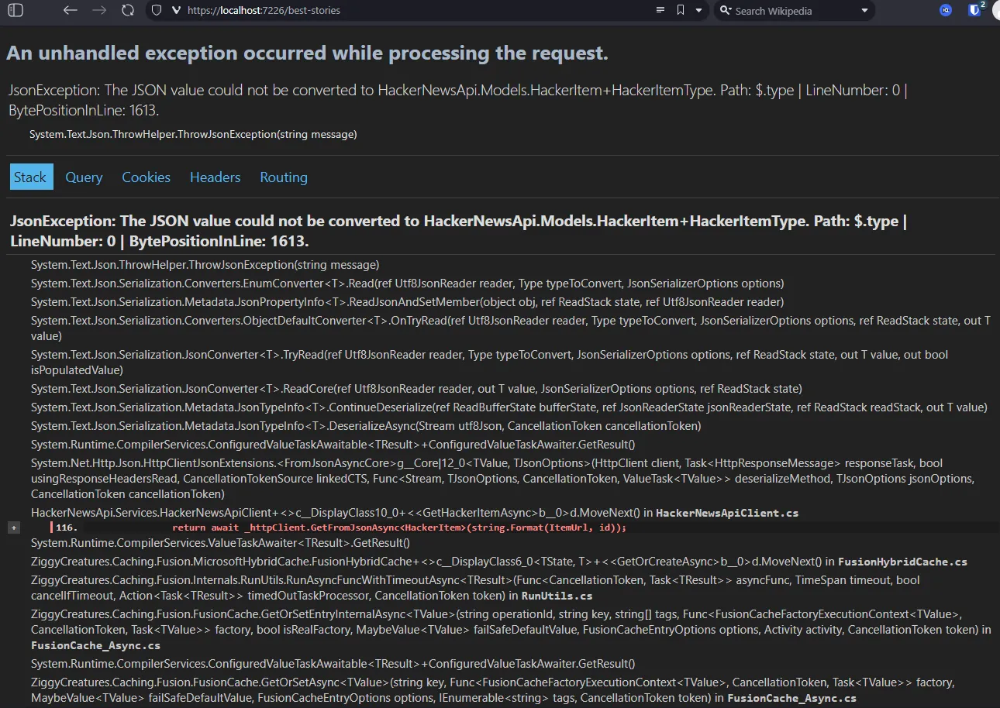
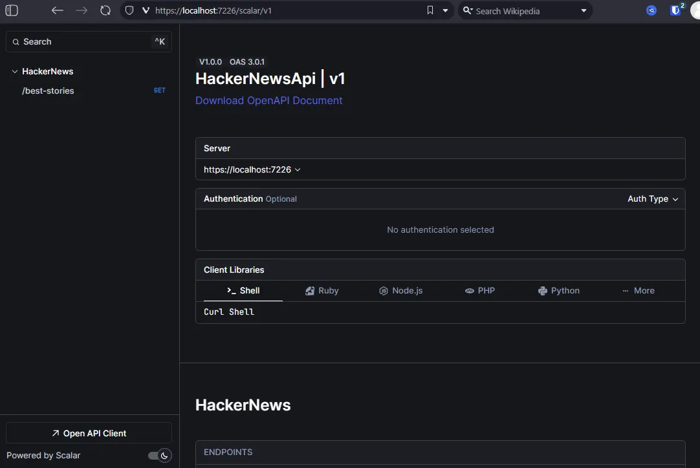
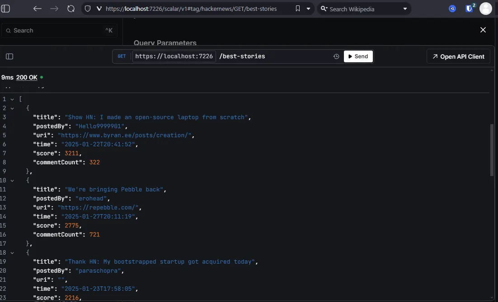

# hacker-news-api

## Description

This is a sample ASP.Net Core 9 service that wraps [Hacker News API](https://github.com/HackerNews/API).

## Features

- **API Integration**: Fetches the most recent best stories from [Hacker News Endpoint](https://hacker-news.firebaseio.com/v0/).
- **Caching Mechanism**:
  - Creates local caches of fetched data using new [HybridCache](https://learn.microsoft.com/en-us/aspnet/core/performance/caching/hybrid?view=aspnetcore-9.0):
  - Implemented using open-source hybrid cache package [ZiggyCreatures.FusionCache](https://github.com/ZiggyCreatures/FusionCache).
  - Uses [MemoryCache](https://learn.microsoft.com/en-us/dotnet/api/microsoft.extensions.caching.memory.imemorycache?view=net-9.0-pp) as 1st level cache storage.
  - Allows easy adding of any 2nd level (distributed) cache service that implements **_IDistributedCache_**.
- **Offline API Client**: Utilizes [Scalar](https://github.com/scalar/scalar) for OpenAPI interface.
- **Error Handling**: Provides detailed error stack traces in development mode.
  

## Requirements

- [.NET Core 9.0 SDK](https://dotnet.microsoft.com/en-us/download/dotnet/9.0)
- PowerShell

## Usage

- Open PowerShell.
- Execute **_./Start-Development.ps1_** to start using development profile.
- Launch [https://localhost:7226/scalar/v1](https://localhost:7226/scalar/v1) link in browser to access **_Scalar_** UI.
  

## API Endpoints

```http
GET {HOST_ADDRESS}/best-stories?count={count}&order={desc}
```

Query parameters:

- **{count}**: specifies number of latest stories.
- **{order}**: Optional parameter that specifies sorting by Hacker Story "Score" property. Valid values: **_asc_**, **_desc_** (**_desc_** is a default value).

Example output:

```http
GET {HOST_ADDRESS}/best-stories?count=20&order=desc
```



## TODO:

- **Testing**:
  - **_Unit Tests_**: To be implemented using Moq. Note: [HybridCache] doesn't natively provide an interface, so custom implementation may be required.
  - **_Integration Tests_**: To test API integrity and performance against [Hacker News API](https://github.com/HackerNews/API).
- **RateLimit**:
  - **_Inbound requests_**: Implement [**_Microsoft.AspNetCore.RateLimiting_**](https://learn.microsoft.com/en-us/aspnet/core/performance/rate-limit?view=aspnetcore-9.0) to protect API from DoS attacks.
  - **_Outbound requests_**: Implement RateLimiting with retry mechanism for fetching data from [Hacker News API](https://github.com/HackerNews/API).
- **Containerization**:
  - Create a **_DockerCompose_** setup for Linux platform.
  - Integrate distributed cache services (e.g., [Redis](https://learn.microsoft.com/en-us/dotnet/api/microsoft.extensions.caching.stackexchangeredis.rediscache?view=net-9.0-pp), [Azure CosmoDB](https://learn.microsoft.com/en-us/azure/cosmos-db/introduction), etc.) with **HybridCache**.
- **Migration**:
  - [minimal API](https://learn.microsoft.com/en-us/aspnet/core/fundamentals/minimal-apis?view=aspnetcore-9.0).
- Tune API response in case of errors.
- Other changes based on customer feadback.
